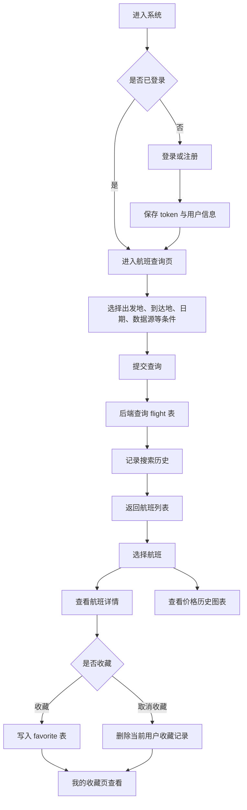
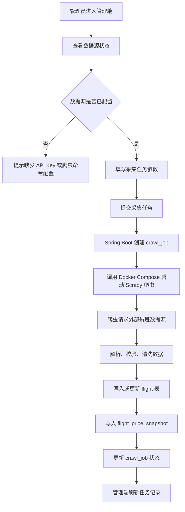

# 课程报告前期工作补充

## 1. 产品定位

本项目为“机票抓取与自动更新系统”，当前实现重点是航班数据采集、自动同步、查询展示、用户收藏和采集任务管理。系统面向课程设计演示场景，采用 Vue 3 前端、Spring Boot 后端、Scrapy 爬虫和 MySQL 数据库组成三层架构。用户通过前端查询航班、查看详情和价格历史；管理员通过管理端触发采集任务、查看任务记录和数据源状态；爬虫负责从外部数据源采集航班数据并直接写入数据库。

当前代码中保留了 AI/chat 相关模块，但它不是本阶段核心交付。本补充材料以当前代码为基准，重点说明已经具备演示闭环的主线功能。

## 2. 用户角色与核心目标

| 角色 | 核心目标 | 对应功能 |
|---|---|---|
| 普通用户 | 快速查询航班并保存关注航班 | 登录注册、航班查询、航班详情、价格历史、收藏、搜索历史 |
| 管理用户 | 维护航班数据更新过程 | 采集任务创建、任务记录查看、数据源状态查看、指定机场日期同步 |
| 系统爬虫 | 自动采集并更新航班数据 | 调用外部数据源、数据清洗、写入 MySQL、记录采集任务 |

## 3. 产品流程图

### 3.1 用户端查询与收藏流程

### 3.2 管理端采集任务流程

### 3.3 航班数据自动更新闭环

## 4. 产品原型图说明

原型以当前前端页面结构为准，采用低保真方式表达页面布局、信息层级和主要操作入口。配套 HTML 图册位于 `assets/前期工作图册.html`，可在浏览器中打开并截图作为答辩图片。

### 4.1 登录/注册页

页面用于完成用户身份认证。顶部提供中英文切换，主体卡片包含系统名称、登录/注册切换、用户名、密码、昵称输入框以及提交按钮。登录或注册成功后，前端保存 token 和用户信息，并跳转到航班查询页。

### 4.2 航班查询工作台

航班查询页是用户端核心页面。页面上方包含“指定日期航班同步”和“航班筛选查询”两个区域；中部展示同步结果条和航班列表；右侧展示选中航班的详情和价格历史；底部保留 AI 建议模块作为扩展能力入口。该页面同时承担查询、同步、详情查看、收藏和价格趋势观察等任务。

### 4.3 我的收藏页

收藏页展示当前用户收藏的航班记录。用户可以从航班列表或详情卡片点击收藏按钮写入收藏，也可以在收藏页查看已关注航班，便于后续比较价格和出行安排。

### 4.4 搜索历史页

搜索历史页展示用户历史查询条件。当前实现中，搜索历史不是前端主动写入，而是在 `GET /api/flights` 查询时由后端自动记录。这种设计可以保证历史记录与真实查询行为一致。

### 4.5 采集任务管理页

管理端采集任务页面向管理员。页面包含数据源、出发地、到达地、日期、乘客数量、最大结果数等任务参数，并展示最近采集任务记录。任务记录中包含任务编号、数据源、状态、成功条数、失败条数和开始时间。

### 4.6 数据源状态页

数据源状态页用于确认外部数据源和爬虫运行条件是否满足。系统会根据配置判断数据源是否可用，帮助管理员在发起采集任务前发现 API Key 或爬虫命令配置问题。

## 5. 可行性分析

### 5.1 技术可行性

项目采用成熟技术栈：前端使用 Vue 3、Vite、Element Plus 和 ECharts，适合快速构建管理后台和数据查询页面；后端使用 Spring Boot 3.3.5 和 JDBC，能够稳定提供 REST API，并通过手写 SQL 明确控制查询逻辑；爬虫使用 Scrapy 和 PyMySQL，适合处理外部航班数据采集、清洗和直接入库；数据库使用 MySQL，能够满足课程项目对结构化航班数据、用户数据和采集任务记录的存储需求。

当前系统已经形成完整链路：前端调用后端接口，后端读取 MySQL，爬虫通过 pipeline 写入 MySQL，管理端可以触发同步任务。因此从技术实现角度看，系统具备开发、运行和演示基础。

### 5.2 经济可行性

项目主要依赖开源技术和本地开发环境。Vue、Spring Boot、Scrapy、MySQL、Docker Desktop 等均可用于课程开发，不需要额外采购商业软件。外部航班数据接口可能需要 API Key，但系统在没有真实外部 API 配置时仍可通过样例数据和本地流程进行演示。因此在课程设计范围内，项目成本可控。

### 5.3 操作可行性

系统页面按用户端和管理端划分，普通用户主要操作集中在查询、查看详情、收藏和历史记录；管理员主要操作集中在采集任务和数据源状态。页面流程清晰，表单项和按钮与实际业务动作对应，适合课程答辩时按“登录、查询、同步、查看详情、收藏、管理采集任务”的顺序演示。

### 5.4 数据可行性

系统数据库围绕航班主数据、价格快照、采集任务、用户、token、收藏和搜索历史组织。`flight` 表通过航班号、出发时间和数据源控制重复数据更新，`flight_price_snapshot` 用于保留价格变化记录，`crawl_job` 用于记录每次采集任务状态。该数据模型能够支撑当前查询展示和自动更新需求。

需要注意的是，真实航班数据依赖外部数据源配置，数据完整性会受到 API 权限、调用额度、网络稳定性和字段返回质量影响。课程演示时应提前准备可用数据或样例数据，避免外部接口不可用影响展示。

### 5.5 时间与开发可行性

当前项目已经具备前端页面、后端接口、数据库表结构和爬虫采集模块，前期设计材料可以围绕现有实现补齐，不需要额外开发大型功能。后续完善重点应放在演示数据准备、文档整理、截图制作和答辩讲解路径上。

### 5.6 风险与应对

| 风险 | 影响 | 应对措施 |
|---|---|---|
| 外部 API Key 未配置或额度不足 | 采集任务无法返回真实数据 | 准备样例数据；在数据源状态页展示配置状态 |
| 外部数据字段变化 | 爬虫解析或入库失败 | 在 pipeline 中保留校验逻辑，并记录失败原因 |
| 本地环境依赖较多 | 演示前启动步骤复杂 | 提前按 MySQL、后端、前端、爬虫顺序验证 |
| token 失效或未登录 | 用户无法进入主页面 | 使用登录页重新认证，保留默认测试账号或注册流程 |
| 数据量不足 | 图表和列表展示不充分 | 演示前手动触发同步或导入样例航班数据 |

## 6. 答辩演示建议

建议答辩时按以下路径展示：

1. 展示系统定位：航班数据采集与查询系统。
2. 展示产品流程图：说明用户端、管理端和爬虫数据闭环。
3. 打开登录页，完成登录或注册。
4. 进入航班查询页，按条件查询航班。
5. 选择一条航班，展示详情和价格历史。
6. 点击收藏，进入我的收藏页查看。
7. 打开搜索历史页，说明历史由后端自动记录。
8. 进入管理端，查看数据源状态和采集任务记录。
9. 总结系统技术可行性和当前阶段限制。

## 7. 小结

从产品流程、页面原型和可行性分析看，本项目已经具备课程设计所需的完整业务闭环。系统主线聚焦航班数据采集、自动更新、查询展示和用户收藏，技术选型成熟，模块边界清晰，演示路径明确。后续工作应以报告整理、演示数据准备和答辩材料制作作为重点。
